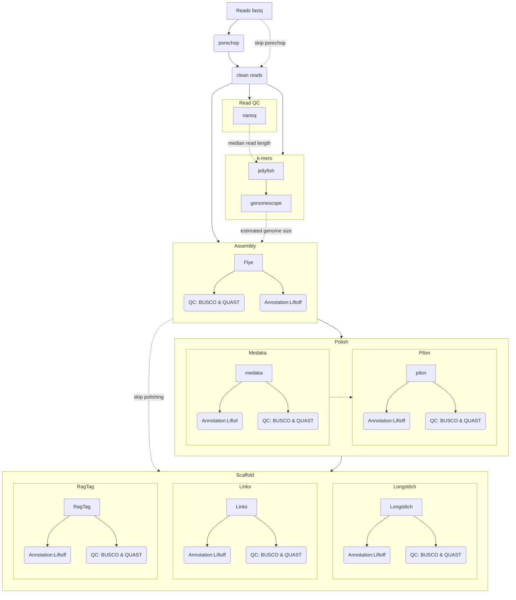
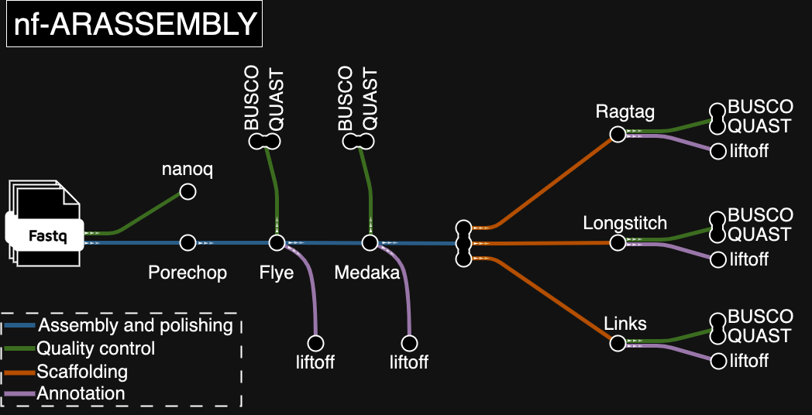

[](https://zenodo.org/doi/10.5281/zenodo.10972895)

# nf-arassembly

Assembly pipeline for arabidopsis genomes from nanopore sequencing written in [`nextflow`](https://nextflow.io/). Should also work for other species.
Experimental support for combinations of ONT and pacbio HiFi data.

# Procedure

  * Extract all fastq.gz files in the readpath folder into a single fastq file. By default this is skipped, enable with `--collect`.
  * Barcodes and adaptors will be removed using [`porechop`](https://github.com/rrwick/Porechop). By default this is skipped, enable with `--porechop`.
  * Read QC is done via [`nanoq`](https://github.com/esteinig/nanoq).
  * k-mer based assessment of the reads via [`Jellyfish`](https://github.com/gmarcais/Jellyfish) and [`genomescope`](https://github.com/schatzlab/genomescope/)
  * Assemblies are performed with [`flye`](https://github.com/fenderglass/Flye) or [`hifiasm`](https://github.com/chhylp123/hifiasm)
  * Polishing is done using medaka, and scaffolding via [`LINKS`](https://github.com/bcgsc/LINKS), [`longstitch`](https://github.com/bcgsc/longstitch) and / or [`ragtag`](https://github.com/malonge/RagTag). 
  * Optional short-read polishing can be done using [`pilon`](https://github.com/broadinstitute/pilon). By default this is not done, enable with `--polish_pilon`, requires different samplesheet with shortreads.
  * Annotations are lifted from reference using [`liftoff`](https://github.com/agshumate/Liftoff). 
  * Quality of each stage is assessed using [`QUAST`](https://github.com/ablab/quast) and [`BUSCO`](https://gitlab.com/ezlab/busco) (standalone).

# Parameters

See also [schema.md](schema.md)


| Parameter | Effect |
| --- | --- |
| `--samplesheet` | Path to samplesheet |
| `--collect` | Are the provided reads a folder (`true`) or a single fq files (default: `false` ) |
| `--use_ref` | Use a refence genome? (default: `true`) |
| `--porechop` | Run [`porechop`](https://github.com/rrwick/Porechop)? (default: `false`) |
| `--kmer_length` | kmer size for [`Jellyfish`](https://github.com/gmarcais/Jellyfish)? (default: 21) |
| `--read_length` | Read length for [`genomescope`](https://github.com/schatzlab/genomescope/)? If this is `null` (default), the median read length estimated by [`nanoq`](https://github.com/esteinig/nanoq). will be used. If this is not `null`, the given value will be used for _all_ samples. |
| `--hifi` | Additional pacbio hifi reads are available? default: `false`|
| `--hifi_ont` | Use hifi and ONT reads with `hifiasm --ul`? default: `false`|
| `--hifi_args` | Extra arguments passed to [`hifiasm`](https://github.com/chhylp123/hifiasm). default: `''`|
| `--flye_mode` | The mode to be used by [`flye`](https://github.com/fenderglass/Flye); default: `"--nano-hq"` |
| `--genome_size` | Expected genome size for [`flye`](https://github.com/fenderglass/Flye). If this is `null` (default), the haploid genome size for each sample will be estimated via [`genomescope`](https://github.com/schatzlab/genomescope/). If this is not `null`, the given value will be used for _all_ samples. |
| `--flye_args` | Arguments to be passed to [`flye`](https://github.com/fenderglass/Flye), default: `none`. Example: `--flye_args '--genome-size 130g --asm-coverage 50'` |
| `--polish_medaka` | Polish using [`medaka`](https://github.com/nanoporetech/medaka), default: `true` |
| `--medaka_model` | Model used by [`medaka`](https://github.com/nanoporetech/medaka), default: 'r1041_e82_400bps_hac@v4.2.0:consesus' |
| `--polish_pilon` | Polish with short reads using [`pilon`](https://github.com/broadinstitute/pilon)? Sefault: `false` |
| `--busco_db` | Path to local [`BUSCO`](https://gitlab.com/ezlab/busco) db?; default: `/dss/dsslegfs01/pn73so/pn73so-dss-0000/becker_common/software/busco_db` |
| `--busco_lineage` | [`BUSCO`](https://gitlab.com/ezlab/busco) lineage to use; default: `brassicales_odb10` |
| `--scaffold_ragtag` | Scaffolding with [`ragtag`](https://github.com/malonge/RagTag)? Default: `false` |
| `--scaffold_links` | Scaffolding with [`LINKS`](https://github.com/bcgsc/LINKS)? Default: `false` |
| `--scaffold_longstitch` | Scaffolding with [`longstitch`](https://github.com/bcgsc/longstitch)? Default: `false` |
| `--lift_annotations` | Lift annotations from reference using [`liftoff`](https://github.com/agshumate/Liftoff)? Default: `true` |
| `--skip_flye` | Skip assembly with [`flye`](https://github.com/fenderglass/Flye)?, requires different samplesheet (!); Default: `false` |
| `--skip_alignments` | Skip alignments with [`minimap2`](https://github.com/lh3/minimap2)? requires different samplesheet (!); Default: `false` |
| `--out` | Results directory, default: `'./results'` |

# Graph



# Tubemap



# Usage

Clone this repo:

```
git clone https://github.com/nschan/nf-arassembly/
```

## Standard Pipeline

The standard pipeline assumes nanopore reads (10.14).

The samplesheet _must_ adhere to this format, including the header row. Please note the absence of spaces after the commas:

```
sample,ontreads,ref_fasta,ref_gff
sampleName,path/to/reads,path/to/reference.fasta,path/to/reference.gff
```

To run the pipeline with a samplesheet on biohpc_gen:
```
nextflow run nf-arassembly --samplesheet 'path/to/sample_sheet.csv' \
                           --out './results' \
                           -profile charliecloud,biohpc_gen
```

## Additional hifireads

The pipeline expects ONT and HiFi reads:

```
sample,ontreads,hifireads,ref_fasta,ref_gff
sampleName,path/to/ontreads,path/to/hifireads.fq.gz,path/to/reference.fasta,path/to/reference.gff
```

## No refence genome

If there is no reference genome available use `--use_ref false` to disable the reference genome.
Liftoff should not be used without a reference, QUAST will no longer compare to reference. 

## Usage with PacBio reads

When pac-bio reads are used, i changing flye mode and skipping medaka.

```
--flye_mode '--pacbio-raw' --polish_medaka false
```

or, if HiFi reads are used:

```
--flye_mode '--pacbio-hifi' --polish_medaka false
```


## Skipping Flye

In case you already have an assembly and would only like to check it with QUAST and polish use
`--skip_flye true`

This mode requires a different samplesheet:

```
sample,readpath,assembly,ref_fasta,ref_gff
sampleName,path/to/reads,assembly.fasta.gz,reference.fasta,reference.gff
```

When skipping flye the original reads will be mapped to the assembly and the reference genome.

## Skipping Flye and mappings

In case you have an assembly and have already mapped your reads to the assembly and the reference genome you can use
`--skip_flye true --skip_alignments true`

This mode requires a different samplesheet:

```
sample,readpath,assembly,ref_fasta,ref_gff,assembly_bam,assembly_bai,ref_bam
sampleName,reads,assembly.fasta.gz,reference.fasta,reference.gff,reads_on_assembly.bam,reads_on_assembly.bai,reads_on_reference.bam
```

## Polishing with pilon

The assemblies can optionally be polished using available short-reads using [`pilon`](https://github.com/broadinstitute/pilon).
`--polish_pilon`

This requires additional information in the samplesheet: `shortread_F`, `shortread_R` and `paired`:

```
sample,readpath,ref_fasta,ref_gff,shortread_F,shortread_R,paired
sampleName,reads,assembly.fasta.gz,reference.fasta,reference.gff,short_F1.fastq,short_F2.fastq,true
```

In a case where only single-reads are available, `shortread_R` should be empty, and `paired` should be false

## Scaffolding

[`LINKS`](https://github.com/bcgsc/LINKS), [`longstitch`](https://github.com/bcgsc/longstitch) and / or [`ragtag`](https://github.com/malonge/RagTag) can be used for scaffolding.

## Using liftoff

If `lift_annotations` is used (default), the annotations from the reference genome will be mapped to assemblies and scaffolds using liftoff.
This will happen at each step of the pipeline where a new genome fasta is created, i.e. after assembly, after polishing and after scaffolding.

## QUAST

[`QUAST`](https://github.com/ablab/quast) will run with the following additional parameters:

```
        --eukaryote \\
        --glimmer \\
        --conserved-genes-finding \\
```

# Acknowledgements

This pipeline builds on [modules](https://github.com/nf-core/modules) developed by [`nf-core`](https://nf-co.re). 